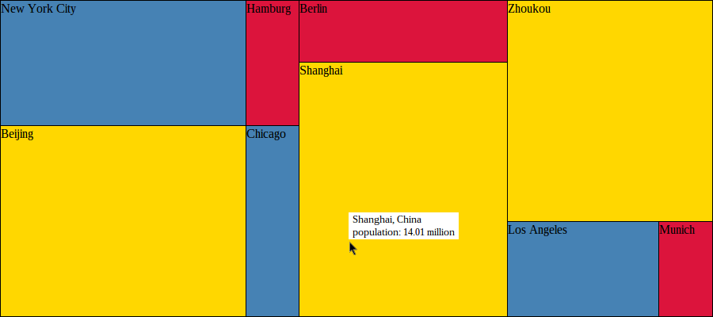

Custom model example
====================

This example uses the [TreemapUI][] library to visualize the population of various cities from different countries. The size of a treemap node corresponds to the number of residents of the city and the color of the node encodes the affiliation of the city to a country. The picture below displays the final result of the [example code](../example/custom_model/).



The `City` class extends `Leaf` from the [TreemapUI][] library and adds a couple additional properties. We can display these properties in our treemap by implementing a custom `LeafDecorator`. You can notify the treemap that a property which affects the label, tooltip or color of a node has changed by calling `fireVisiblePropertyChangedEvent()`. The `Leaf.size` setter issues update events automatically, so that you don't have to do anything when you modify this value. 

In order to demonstrate the live update feature of the `Treemap` class, we made two mistakes when setting up our data model in `main.dart`. The two timers at the end of the `main()` function rectify the data model and the treemap updates automatically at runtime.


**city.dart**:
```Dart
part of treemap_ui.example.custom_model;

class City extends Leaf {

  String _name;
  String _country;
  
  City(this._name, this._country, num population) : super(population);
  
  String get name => _name;
  
  set name(String name) {
    _name = name;
    fireVisiblePropertyChangedEvent();
  }
  
  String get country => _country;
  
  set country(String country) {
    _country = country;
    fireVisiblePropertyChangedEvent();
  }
  
  num get population => size;

  set population(num population) => this.size = population;
  
}
```

**custom_leaf_decorator.dart:**
```Dart
part of treemap_ui.example.custom_model;

class CustomLeafDecorator implements LeafDecorator<City> {
  
  const CustomLeafDecorator();
  
  Element createLabel(City city) => new Element.html("<span>${city.name}</span>");

  Element createTooltip(City city) {
    Element element = new DivElement(); 
    element.style..backgroundColor = "white"
        ..fontSize = "0.8em"
        ..padding = "1px 5px 1px 5px";
    element.appendHtml("<span>${city.name}, ${city.country}</span><br/>");
    element.appendHtml("<span>population: ${city.population} million</span>");
    return element; 
  }

  Color defineNodeColor(City city) {
    var color;
    switch(city.country) {
        case 'China':
            color = Color.GOLD;
            break;
        case 'USA':
            color = Color.STEEL_BLUE;
            break;
        case 'Germany':
            color = Color.CRIMSON;
            break;
    }
    return color;
  }
}
```

**main.dart:**
```Dart
library treemap_ui.example.custom_model;

import 'dart:html';
import 'dart:async';
import 'package:treemap_ui/treemap_ui.dart';

part 'city.dart';
part 'custom_leaf_decorator.dart';

main() {
  final displayArea = new DivElement();
  displayArea.style..width = "900px"
                   ..height = "400px";
  document.body.children.add(displayArea);
  
  final model = new Branch([new City("New York City", "USA", 1), 
                            new City("Hamburg", "Germany", 1.774), 
                            new City("Beijing", "China", 12.46), 
                            new City("Chicago", "USA", 2.696), 
                            new City("Berlin", "USA", 3.443),   
                            new City("Shanghai", "China", 14.01), 
                            new City("Zhoukou", "China", 12.07), 
                            new City("Los Angeles", "USA", 3.793),
                            new City("Munich", "Germany", 1.353)]);
  
  final treemap = new Treemap(displayArea,model,new Pivot(byMiddle),
                              leafDecorator: const CustomLeafDecorator());
  
  new Timer(const Duration(seconds: 1),(){
    final City newYork = model.children.firstWhere((City city) => city.name == 'New York City');
    newYork.population = 8.175;
  });
  
  new Timer(const Duration(seconds: 2),(){
    final City berlin = model.children.firstWhere((City city) => city.name == 'Berlin');
    berlin.country = 'Germany';
  });
}
```
[TreemapUI]: https://github.com/usommerl/treemap_ui/
[tree data structure]: https://en.wikipedia.org/wiki/Tree_(data_structure)
